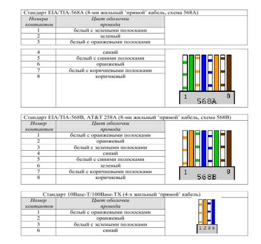
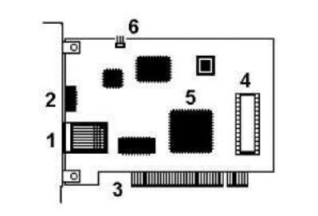

# Лабораторная работа №1

## Тема

Подключение персонального компьютера к локальной вычислительной сети.

## Цель работы

Изучить основные элементы кабельного подключения Ethernet, познакомиться со схемами обжима витой пары и выполнить проверку сетевого соединения.

## Сведения о студенте

| Поле | Данные |
|---|---|
| Фамилия, имя | Терников Сергей |
| Группа | 28ИПО8482 |
| Дисциплина | Компьютерные сети |

## Используемое оборудование

| Наименование | Назначение |
|---|---|
| Персональный компьютер | Проверка подключения к локальной сети |
| Сетевой адаптер Ethernet | Передача данных по кабельной сети |
| Кабель UTP Cat.5e | Изготовление патч-корда |
| Коннекторы 8P8C (RJ-45) | Подключение кабеля к сетевым устройствам |
| Кримпер | Обжим коннектора |
| Кабельный тестер | Проверка правильности обжима |

## Теоретическая часть

Локальная вычислительная сеть объединяет компьютеры и другие устройства в пределах кабинета, здания или организации. Для проводного подключения чаще всего используется технология Ethernet и кабель типа витая пара.

### Кабель UTP и разъем RJ-45

Кабель UTP состоит из четырех пар проводников. Скручивание проводов уменьшает влияние электромагнитных помех и повышает устойчивость передачи данных.


Разъем, который обычно называют RJ-45, в техническом смысле является модульным коннектором 8P8C. Он имеет восемь контактов для подключения жил кабеля.

### Топология Ethernet

В современных локальных сетях чаще всего используется топология «звезда»: компьютеры подключаются к коммутатору, а коммутатор передает кадры между устройствами.


Также возможно прямое соединение двух компьютеров. Для старого оборудования в таком случае мог потребоваться кроссовер-кабель, но многие современные адаптеры поддерживают Auto MDI-X.

### Прямой и перекрестный кабель

Прямой кабель используется для подключения компьютера к коммутатору или маршрутизатору. Перекрестный кабель применяется для соединения однотипных устройств, если оборудование не поддерживает автоматическое определение типа порта.


### Гальваническая развязка

В сетевых интерфейсах Ethernet используется гальваническая развязка. Она снижает риск повреждения оборудования и помогает защитить устройства от разности потенциалов.


## Инструменты и схема обжима

Для монтажа коннектора используется кримпер. Перед обжимом необходимо снять внешнюю оболочку кабеля, расправить жилы, расположить их в нужном порядке и вставить в коннектор до упора.


В работе используется схема T568B.



### Распиновка по стандарту T568B

| Контакт | Цвет проводника |
|---:|---|
| 1 | Бело-оранжевый |
| 2 | Оранжевый |
| 3 | Бело-зеленый |
| 4 | Синий |
| 5 | Бело-синий |
| 6 | Зеленый |
| 7 | Бело-коричневый |
| 8 | Коричневый |

Для прямого кабеля порядок жил одинаковый на обоих концах. Для кроссовер-кабеля один конец обжимается по T568A, другой по T568B.


## Ход выполнения работы

### 1. Подготовка кабеля

Был подготовлен отрезок кабеля UTP Cat.5e. С внешней оболочки снята изоляция примерно на 12-15 мм, после чего пары проводников были аккуратно расплетены и выровнены.

### 2. Раскладка жил

Проводники были расположены по схеме T568B:

```text
1 - бело-оранжевый
2 - оранжевый
3 - бело-зеленый
4 - синий
5 - бело-синий
6 - зеленый
7 - бело-коричневый
8 - коричневый
```

### 3. Установка коннектора

Жилы были вставлены в коннектор до упора. Важно, чтобы каждый проводник дошел до своего контакта, а внешняя оболочка кабеля попала под фиксатор коннектора.

### 4. Обжим кабеля

Коннектор был зафиксирован кримпером. После обжима контакты прорезали изоляцию жил и обеспечили электрическое соединение.

### 5. Проверка кабеля

Кабель был проверен тестером. Все линии показали корректное соединение.

| Контакт | Результат проверки |
|---:|---|
| 1 | OK |
| 2 | OK |
| 3 | OK |
| 4 | OK |
| 5 | OK |
| 6 | OK |
| 7 | OK |
| 8 | OK |

## Параметры сетевого адаптера



Для просмотра параметров сетевого адаптера используется команда:

```powershell
ipconfig /all
```

Пример фиксируемых параметров:

| Параметр | Значение |
|---|---|
| Тип адаптера | Ethernet |
| Физический адрес | определяется командой `ipconfig /all` |
| Скорость подключения | 100/1000 Мбит/с |
| Протокол | IPv4 |
| Способ получения адреса | DHCP или ручная настройка |

## Проверка сетевого соединения

Для проверки доступности шлюза или другого узла используется команда:

```powershell
ping 192.168.1.1
```

Ожидаемый результат успешной проверки:

| Показатель | Значение |
|---|---|
| Отправлено пакетов | 4 |
| Получено пакетов | 4 |
| Потери | 0 % |
| Среднее время ответа | 1-5 мс |

Если пакеты не проходят, необходимо проверить правильность обжима, состояние сетевого адаптера, IP-адрес, маску подсети и адрес шлюза.

## Контрольные вопросы

### 1. Какие типы кабелей применяются в Ethernet?

В сетях Ethernet применяются витая пара, оптоволоконный кабель и коаксиальный кабель. В современных локальных сетях чаще всего используется витая пара UTP или FTP категорий Cat.5e, Cat.6 и выше.

### 2. Что такое UTP?

UTP - это неэкранированная витая пара. Кабель состоит из нескольких пар медных проводников, скрученных между собой для уменьшения помех.

### 3. Чем отличаются MDI и MDIX?

MDI используется на сетевых адаптерах компьютеров, а MDIX - на портах коммутаторов. Раньше для соединения однотипных устройств требовался кроссовер-кабель. Современное оборудование часто поддерживает Auto MDI-X и автоматически подстраивает линии приема и передачи.

### 4. Почему отдельные жилы не зачищаются перед обжимом?

Контакты коннектора 8P8C при обжиме сами прорезают изоляцию проводников и создают электрический контакт. Поэтому зачищать каждую жилу отдельно не требуется.

### 5. Для чего нужен MAC-адрес?

MAC-адрес является уникальным аппаратным адресом сетевого интерфейса. Он используется для доставки кадров внутри локальной сети.

### 6. Какие параметры настраиваются у сетевого адаптера?

Основные параметры: IP-адрес, маска подсети, шлюз по умолчанию, DNS-серверы, скорость и режим дуплекса.

## Вывод

В ходе лабораторной работы были изучены принципы подключения персонального компьютера к локальной сети, рассмотрены схемы обжима витой пары и выполнена проверка соединения. Правильная распиновка кабеля и корректная настройка сетевого адаптера являются обязательными условиями стабильной работы Ethernet-сети
